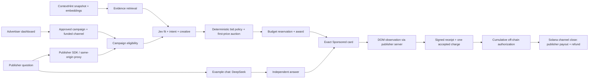

# Current system architecture

Implemented release, 7 October 2026. The earlier component proposals are preserved
in [MVP_MASTER_PLAN.md](MVP_MASTER_PLAN.md); this page describes the current product.

## One user turn

The advertiser's declarations are hard eligibility inputs. Its authored hints
and retrieved observed/inferred ContextHint evidence are separate Jev inputs.
Jev does not select amounts, override caps or sign payments. The highest valid
admitted bid wins the deterministic first-price auction. No-fill leaves the
independent answer available; an award reserves budget until accepted delivery,
explicit failure or expiry. Stable turn/award identities prevent duplicate charges.

DeepSeek is only the example publisher app's organic provider. An integrating
publisher keeps its own LLM. The answer receives no advertiser material. The ad
path starts in parallel, but the example displays its Sponsored card after the
answer. No zero-latency or organic endorsement claim follows from parallelism.

## Implementation ownership

| Source | Responsibility |
|---|---|
| `apps/marketing`, `design-system/prospectus` | Landing and chaptered video |
| `apps/product-ui`, `design-system/ledger` | Dashboard, chat, internals and SDK guide |
| `packages/product/service.mjs`, `api.mjs` | Campaign lifecycle and product API |
| `packages/product/decisions.mjs`, `packages/ml` | Evidence-backed Jev requests and validated decisions |
| `packages/exchange` | Integer budgets, eligibility, first-price auction, reservations and charges |
| `packages/publisher-sdk` | Server transport, safe native rendering, observation and receipt forwarding |
| `packages/product/organic.mjs` | Independent DeepSeek admission and result |
| `packages/product/payments.mjs`, `native.mjs`, `packages/payments` | Accepted-ledger vouchers, pinned native channel adapter and recovery |
| `packages/product/hosted.mjs`, `packages/hosted` | Private encrypted Blob snapshots, CAS/leases and Vercel entry point |
| `scripts/build-site.mjs`, `vercel.json` | One deployment with static clients and Node API |

All clients use one backend authority. No frontend implements another auction,
ledger or signer. The dependency-free publisher SDK is shipped as source; it is
not an npm release. The committed screened evidence lives in `artifacts/v2/evidence`.
The original recorded/live MVP remains in its own `/mvp/` and `/api/runs/*` namespace.

## Hosted state and external effects

Vercel invocations restore SQLite state from two encrypted private Blob snapshots:
financial state (campaigns, provider admissions, awards, receipts, native sessions)
and organic state (example answers/admissions). Neither warm memory nor temporary
disk is authoritative. Read-only GETs project the committed snapshot without a lease.
Financial mutations use an exact-value CAS record containing the snapshot and its
lease; strong Blob ETags fence stale workers. Busy writers return retryable 429.

Durable checkpoints precede paid provider calls and signed transaction broadcast.
Saved admissions are not automatically rerun after uncertainty. Signed bytes and
signatures survive cold starts, so recovery looks up the existing native identity.
Mutation responses are released after the final snapshot is durable. The financial
and organic records are separate stores, not one distributed atomic transaction.
See [HOSTING.md](product/HOSTING.md) for operational details and configuration.

## Solana payment channels

The current network is public Solana Devnet with Circle test USDC. Each fictional
advertiser has a separate channel funded by the bounded shared demo sponsor.
Opening deposits collateral on-chain. Accepted receipts advance signed cumulative
vouchers off-chain; there is no transaction for each ad. Closing pays the saved
latest authorized total to the publisher and returns the unused deposit. SOL
network fees/rent are separate from USDC amounts. A receipt or voucher is not
proof that a payout finalized; recorded finality and token deltas establish that.

Models and browsers never choose a recipient, mint, key or arbitrary monetary
payload. Limits, expiry, accepted-charge correspondence and duplicate/restart
behavior are enforced by the backend. Preserve funded identities during recovery;
never reset state or create another deposit to repair an uncertain operation.

## Evidence and scope

[Native acceptance](../artifacts/product/devnet-acceptance.json) and the
[hosted recording](../artifacts/product/recorded-walkthrough/acceptance.json)
record actual finalized channels, payout/refund and receipt replay. Offline tests
use explicit injected fixtures. These demonstrate the bounded product flow, not
mainnet readiness, independent advertiser wallets, production multi-tenancy,
conversion lift or fleet throughput. ContextHint embeddings and inferred context
inform retrieval; no newly trained AXP model or reconstructed ChatGPT auction is claimed.
